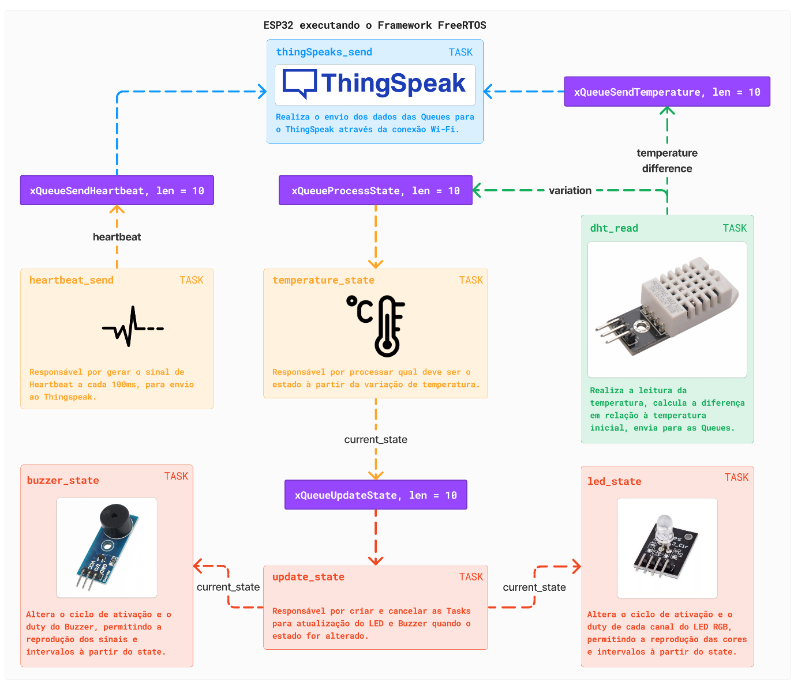

# Real-time-temperature-system
Welcome to the ESP32 Temperature Control System repository! This project focuses on creating a versatile and efficient temperature control system utilizing the ESP32 microcontroller and the DHT11 temperature sensor. With a dynamic range of temperature variation, the system intelligently determines the status based on the measured temperature, triggering specific actions accordingly. The integration of a buzzer and an RGB LED adds a user-friendly dimension, enhancing both functionality and interaction.

We have the follow levels of control : Normal state when the variation is betwwen +-2 Cº, Warning state when the variation is up +- 2 Cº in at least 10 consequtive meditions and critical when the variation is up +-5 Cº in the least 15 consecutive meditions.

temperatura em níveis de variação normal(+-2 Cº)
variação de temperatura > +-2 Cº em pelo menos 10 coletas consecutivas.
variação de temperatura > +-5 Cº em pelo menos 15 coletas consecutivas.

This project was developed  with my computer engineering students at the [FIAP](https://www.fiap.com.br/) university - São Paulo, Brasil. The main contributors were: @ThalitaTome  and @victorvuelma .

- [Setup](#setup)
- [Development](#development)
- [Run](#contribution-guide)

## Setup

The hardware used for this project was:
- dht11
- rgb led
- active buzzer
- esp32

The software configuration:

- esp-idf
- thingspeaks platform

## Development

The solution architecture:


We are using the esp-idf on vscode and the enviroment is linux based system. Please read the docs for more information.

## Run

First start a new project, using the esp-idf. You should have a folder named `template-app` on your `~/esp` folder.
Reeplace the main folder:

```sh
cp -r <where-you-clone-this-repo>/main ~/esp/template-app
```

Then build and flash the project using the esp-idf extencion on vscode, detail instructions on the docs.
